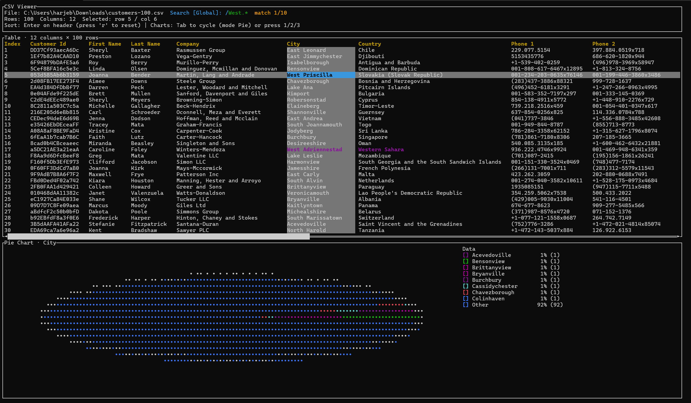

# csvtui

`csvtui` is an interactive terminal UI for exploring CSV files. It renders tabular data with smooth keyboard navigation and includes multiple chart visualizations powered by [Ratatui] and [crossterm].

[Ratatui]: https://ratatui.rs
[crossterm]: https://crates.io/crates/crossterm



## Features

- Load any CSV file by passing its path on the command line.
- Scroll horizontally through wide tables with automatic column sizing and a scrollbar indicator.
- Highlight the active cell, column, or row while navigating with the arrow keys.
- Sort rows by the focused column (press `Enter` on the header) and reset back to CSV order.
- Visualize numeric or categorical data with line, histogram, and pie charts that follow the selected column.
- Run regex-based searches globally or within the focused column, with instant match highlighting and Enter-driven navigation between hits.

## Requirements

- [Rust](https://www.rust-lang.org/tools/install) 1.78 or newer (Rust 2024 edition)

## Quick Start

```bash
cargo run -- path/to/data.csv
```

If no CSV path is supplied, the application starts in read-only mode and prompts you to provide one.

### Keyboard Shortcuts

| Keys | Action |
| ---- | ------ |
| `←` `→` `↑` `↓` | Move the active cell |
| `Home` / `End` | Jump to the first / last column |
| `PageUp` / `PageDown` | Scroll 10 rows at a time |
| `Enter` | Sort by the active column when the header row is selected; otherwise cycle through search matches |
| `Tab` | Cycle through line → histogram → pie charts |
| `1` `2` `3` | Jump directly to line, histogram, or pie chart |
| `r` | Reset to the original CSV ordering |
| `/` | Start a regex search (global by default, column-scoped when a column is selected) |
| `Esc` | First press clears the active cell/column selection, second press quits |
| `q` `Ctrl+C` | Quit |

When entering search mode (`/`), type any valid Rust/PCRE-style regex. Matches are highlighted in the table, scoped either globally or to the focused column, and pressing `Enter` advances to the next occurrence in a loop. The live search prompt appears next to the file name with a blinking caret so you can see what you are typing.

Charts will only render when the focused column contains compatible data (numeric for line/histogram, categorical for pie).

## Development

- `cargo fmt` — format the codebase.
- `cargo clippy --all-targets -- -D warnings` — lint with Clippy.
- `cargo test` — run the test suite (none yet, but kept for parity).

## License

Licensed under the MIT License ([LICENSE](LICENSE)).

Powered by Codex.
